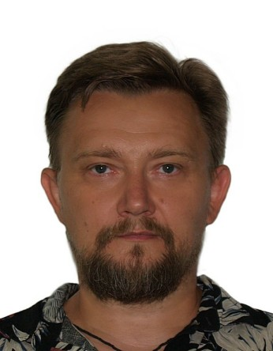
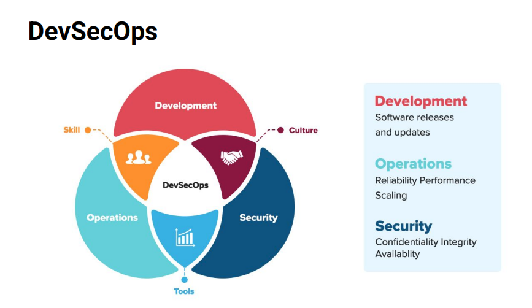
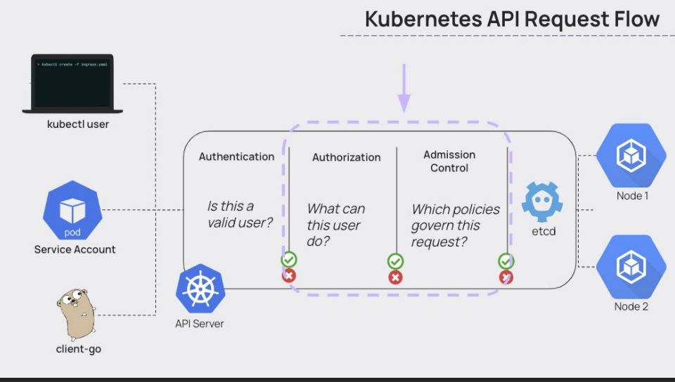
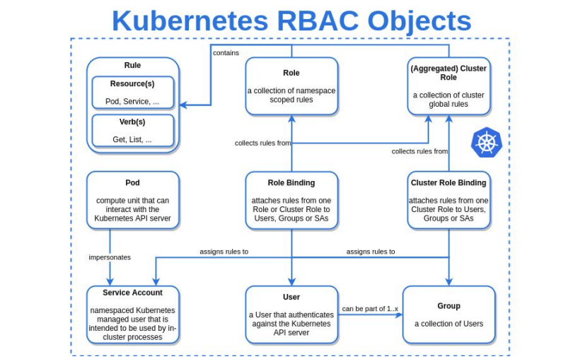

<!-- speaker_note: Nach den tech. gegebenheiten fragen -->


<!-- column_layout: [1,3,1] -->
<!--column: 1 -->
---

* **Keksel Denis**
* 20 Years IT
* 5 DevOps
* Telegram: [](@dkeksel)
* Mail: [](denis.keksel@keksel.pro)
---
<!-- reset_layout -->

<!-- end_slide -->

<!-- column_layout: [1,3,1] -->
<!--column: 1 -->
# Цель Занятия
---
## Ознакомиться с основными аспектами безопасности в кластерах Kuberentes.  
---
## Получить общее представление о передовых методах и инструментах, необходимых для обеспечения безопасности.
---
## Ориентироваться в широком спектре DevSecOps и DevOps 
---
<!-- end_slide -->
<!--
speaker_note: |
    1. Role-Based Access Control 
    Mittels RBAC sollen Benutzer und Service-Accounts  
    Kubernetes Security Best Practices: Top 10 Essentials  
    1. Role-Based Access Control (RBAC)
    Внедрите RBAC для ограничения прав доступа пользователей и служебных учетных записей. Например, разработчик должен иметь доступ только к определенным пространствам имен, в то время как администратор кластера управляет всеми ресурсами. Такие инструменты, как `kubectl create role` и `kubectl apply -f role-binding.yaml`, обеспечивают точный контроль доступа.
    2. Network Policies for Microservices  
    Calico und silium Nutzen um die Networkpolicies zu setzen. Trafic ziwishen den pods soll begrentzt werden
    3. Secrets Management with Vault or Kubernetes Secrets  
    Faelle mit Vault und alternativen beschreiben
    4. Pod Security Admission (PSA)  
    Включите PSA, чтобы предотвратить повышение привилегий. Политики, такие как `restricted`, ограничивают возможности, запрещая доступ root или монтирование томов. Pod, нарушающий эти правила, автоматически отклоняется, что обеспечивает соблюдение базовых требований безопасности.
    5. Regular Pod Image Scanning  
    Сканируйте образы контейнеров на наличие уязвимостей с помощью Clair или Trivy. Например, сканирование может выявить устаревший образ `nginx` с критической уязвимостью CVE, что потребует отката к исправленной версии. Автоматизируйте этот процесс с помощью

-->


<!-- column_layout: [1,3,1] -->
<!--column: 1 -->
# Маршрут вебинара



- 1. Теория и мотивация   
- 2. Управление доступом и настройка ролей
- 3. Сетевые политики для микросервисов  
- 4. Управление секретами с помощью Vault 
- 5. Pod Security Admission (PSA)  
- 6. Регулярное сканирование образов Pod  
- 7. Audit Logging and Monitoring  
- 8. Изоляция кластера при многопользовательском режиме  
- 9. Автоматические проверки соответствия требованиям  

<!-- reset_layout -->
<!-- end_slide -->

# Теория и мотивация   

<!-- column_layout: [1,3,1] -->
<!--column: 1 -->
- Risk's to our applications and Infrastructure 

    [OWASP Kubernetes Top 10](https://owasp.org/www-project-kubernetes-top-ten/)




<!-- reset_layout -->
<!-- end_slide -->

# Управление доступом и настройка ролей

<!-- column_layout: [1,3,1] -->
<!--column: 1 -->
## RBAC 

### Основные компоненты:
*Roles and Bindings*
- `Role`/`ClusterRole`                : Что можно делать (набор разрешений)
- `RoleBinding`/`ClusterRoleBinding`  : Кто может это делать (связь с субъектом)

*Строится на:*
- Субъекты (subject) : user, process
-  Ресурсы (resources) : pod, nodes, secrets
- Глаголы (verbs) : create, get, patch, delete, watch
- Базовые роли: admin, edit, view


<!-- reset_layout -->
<!-- column_layout: [1,1,1] -->
<!--column: 0 -->
 ```shell +no_background +line_numbers
kubectl get roles
kubectl get rolebindings
 ``` 
<!--column: 1 -->
 ```shell +no_background +line_numbers
kubectl kerew install who-can 
kubectl who-can create pods
 ``` 
<!--column: 2 -->
 ```shell +no_background +line_numbers
kubectl describe role
 ``` 
<!-- reset_layout -->
<!-- end_slide -->

<!-- reset_layout -->

# Сетевые политики для микросервисов  

[Cluster Networking](https://kubernetes.io/docs/concepts/cluster-administration/networking/)
> [!TIP]
> По умолчанию все поды могут общаться со всеми
> Политики работают только с CNI-провайдерами
> .

> [!WARNING]
> Используйте Calico или Cilium для определения сетевых политик, изолирующих поды. 
> Пример: политика, ограничивающая трафик между подами `frontend` и `database`, предотвращает латеральное перемещение. 
> Конфигурации YAML определяют разрешенные протоколы, порты и IP-адреса источника/назначения.
> .

## Основные элементы:
- `podSelector` : Группа подов, к которым применяется политика
- `ingress` : Правила для *входящего* трафика
- `egress` : Правила для *исходящего* трафика
- `NetworkPolicy` — это механизм для изоляции подов на уровне сети

<!-- column_layout: [1,3] -->
<!--column: 0 -->

- Basic Calico Installation
```bash +no_background +line_numbers
kubectl apply -f https://docs.projectcalico.org/manifests/calico.yaml
```
- Example IP pool configuration:
```yaml +no_background +line_numbers
- name: default-ipv4pool
  cidr: 192.168.0.0/16
  natOutgoing: true
```

<!-- reset_layout -->
<!-- end_slide -->

# Управление секретами с помощью Vault 
[Vault K8s)](https://developer.hashicorp.com/vault/docs/deploy/kubernetes)
[Stronghold](https://deckhouse.io/products/stronghold/)
- Доступ к секретам и их хранение: 
  - Приложения, использующие службу Vault, работающую в Kubernetes, могут получать доступ к секретам из Vault и хранить их с помощью различных механизмов работы с секретами и методов аутентификации.

- Обеспечение высокой доступности службы Vault: 
  - Благодаря использованию аффинности под (pod affinities), высоконадежного бэкэнд-хранилища (например, Consul) и функции автоматического разблокирования (auto-unseal) служба Vault может стать высоконадежным сервисом в Kubernetes.

- Шифрование как услуга: 
  - Приложения, использующие службу Vault, работающую в Kubernetes, могут использовать механизм секретов Transit в качестве «шифрования как услуги». Это позволяет приложениям переносить задачи шифрования на Vault перед хранением данных в состоянии покоя.

- Журналы аудита для Vault: 
  - Операторы могут присоединить к кластеру Vault постоянный том, который можно использовать для хранения журналов аудита.

- SSH Signing 

<!-- reset_layout -->
<!-- end_slide -->

# Pod Security Admission (PSA)  
> [!WARNING]
> Включите PSA, чтобы предотвратить повышение привилегий. Политики, такие как `restricted`, ограничивают возможности, 
> запрещая доступ root или монтирование томов. Pod, нарушающий эти правила, автоматически отклоняется, что обеспечивает > соблюдение базовых требований безопасности.  
> .

